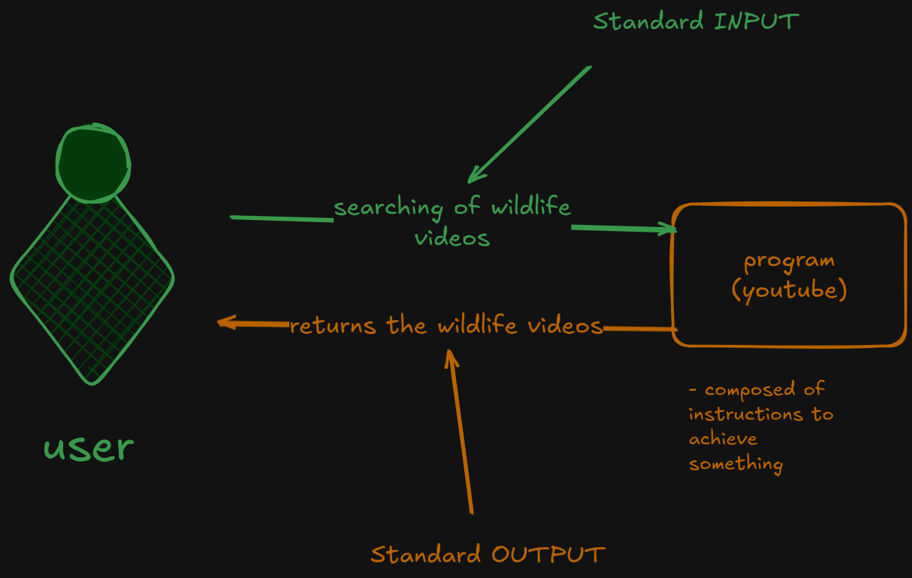
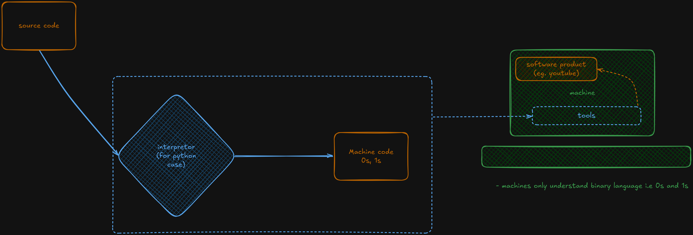

### Setting up virtual environment
*PURPOSE:* To isolate your project from the external ecosystem

- create virtual env, run `python -m venv env`
- if you do not have venv in your system run `pip install virtualenv`
- Once created, confirm either in `bin` subfolder or `Scripts` subfolder whether you can see `activate` files
- If you can see the above;
    - for windows run: `./env/Scripts/activate.bat`
    - for linux run: `source env/bin/activate`

- create a `.gitignore` file in the root folder, this will allow us to separate what is not meant to be *version controlled* and what is meant to be version controlled.

- add environment to `.gitignore` file, 

Simple Standard input/output:  

Resources: 
[Python Doc](https://docs.python.org/3/tutorial/index.html)
[w3schools](https://www.w3schools.com/python/default.asp)